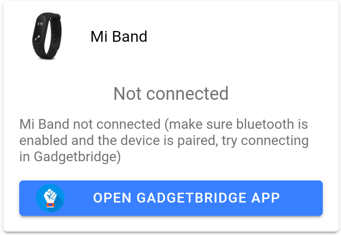
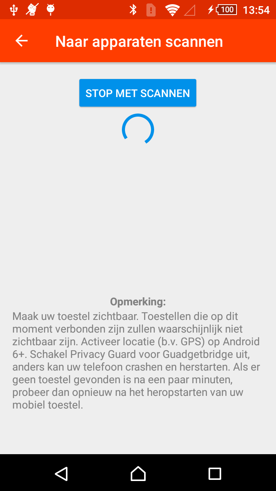
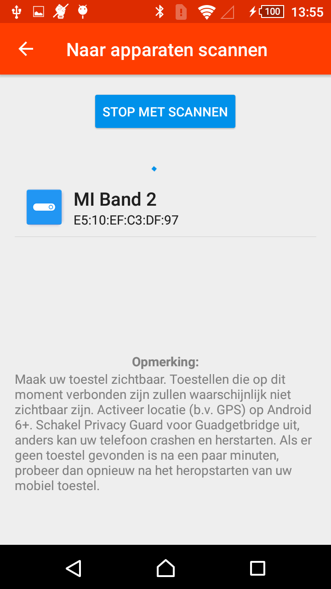
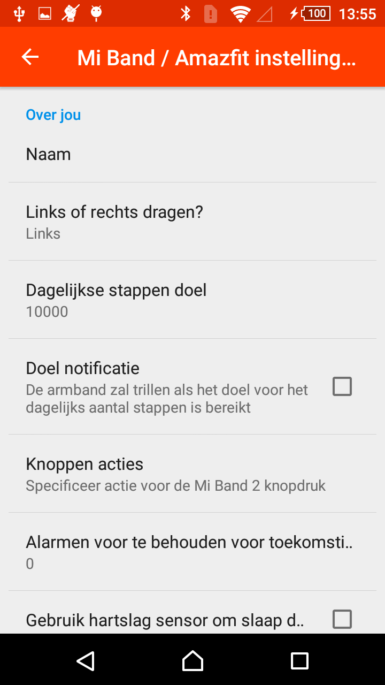
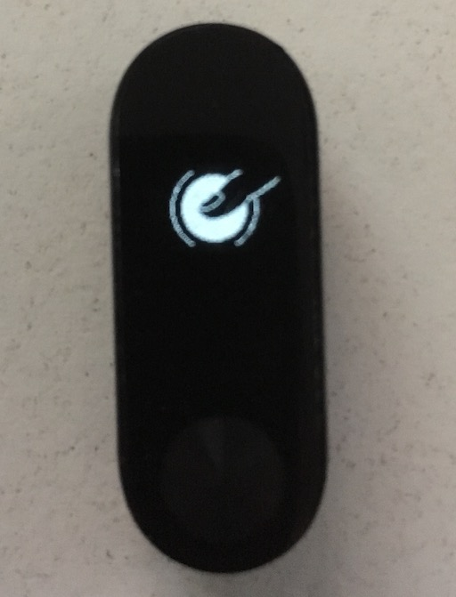
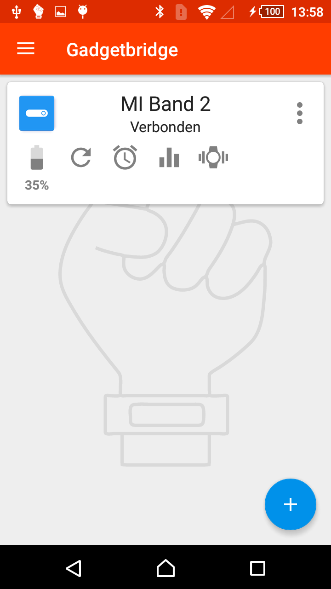
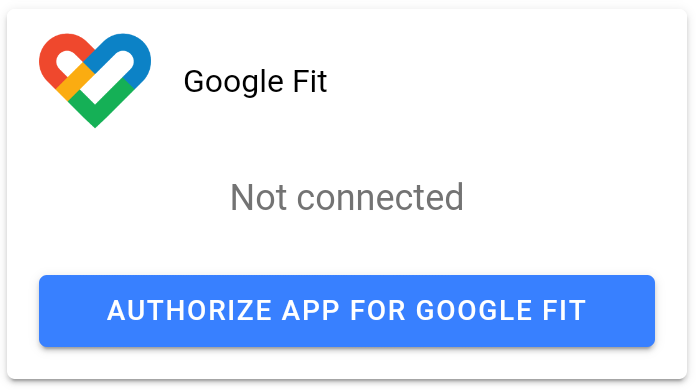

# MITOGO

## Over de app
Doel van de app is de stap data uit te lezen van de Mi Band en die door te sturen naar Google Fit.
Deze app omvat de [Gadgetbridge](https://gadgetbridge.org/) app, een open source alternatief voor de Mi Fit app. Bij het opstarten zal je op een scherm komen met 2 delen een Mi Band deel (met een link om de Gadgetbridge app te openen) en Google Fit deel. Als de pairing met Mi Band is gedaan en authorisatie van Google Fit is toegestaan, zal de resp. stappen gemeten met Mi Band en huidige aantal stappen in Google Fit getoond worden.

Om the starten moet eenmalig een [pairing worden gedaan met de Mi Band](#pairing-met-mi-band) en [toestemming worden gegeven om data naar Google Fit te sturen](#toestemming-voor-google-fit).

## Pairing met Mi Band

- Zorg dat de Mi Band niet gekoppeld is met de telefoon (zie [mogelijke problemen](#mogelijke-problemen))
- Open de MITOGO en Open GadgetBridge app, en eventueel [weiger alle permissies](#openen-gadgetbridge-app).
- Op het Gadgetbridge screen druk op + knop.
- Gadgetbridge begint met scannen.

- na een tijdje komt er een naam van het apparaat (Mi Band 2)

- klik op de naam van het apparaat (Mi Band 2)
- je komt nu in het Mi Band / Amazfit instelling scherm

- naam moet niet worden ingevuld, en de andere instelling moeten niet worden aangepast.
- klik op de terug pijl in de balk links bovenaan

- Na een tijdje zal je Mi Band trillen en oplichten

- druk een aantal keer op het knopje van de Mi Band.
- Nu is je apparaat verbonden met de software.

- druk op de android back button om terug te gaan naar de Mitogo software
- Initieel zullen de stappen gereset worden.

### Openen Gadgetbridge app

- Afhankelijk van de versie van Android zal Gadgetbridge allerlei permissies vragen, maar je mag die gerust weigeren. Deze zijn er omdat Gadgetbridge notificaties van je telefoon kan doorsturen naar je Mi Band. Dit werd niet getest. 

### Mogelijke problemen

#### Kan niet pairen
Het is mogelijk dat het niet lukt om een pair-verbinding te maken. Het is nodig dat je Mi Band niet gekoppeld is met een telefoon of de Mi Fit app, vooraleer je deze kan koppelen met MITOGO

- als je mi band gekoppeld is met de Mi Fit app, ontkoppel deze eerst in de Mi Fit app.
- als de mi band nog gekoppeld in met bluetooth van je Android telefoon. Om te ontkoppelen moet je naar je bluetooth instellingen gaan en het apparaat (Mi Band 2) vergeten/ontkoppelen. (Dit is verschillend per Android telefoon, maar algemeen is het: Ga naar Instellingen, Bluetooth, Gekoppelde apparaten, klik op Mi Band 2 settings, Vergeten)

#### Verbind niet
Als de Mi Band gepaired is, maar er wordt niet automatisch een verbinding gemaakt, kan je in Gadgetbridge op Mi Band venster klikken om te verbinden

#### Na Pairing toont de Mi Band enkel het tijdstip
in Gadgetbridge, ga naar de menu, instellingen, scroll naar onder, Mi Band 2 instellingen, Toon items, verwijder vink van Afstand en Calorieën, OK.

## Toestemming voor Google Fit

- zorg dat Google Fit geinstalleerd is op je toestel
- zorg dat je een netwerkverbinding hebt
- in MITOGO klik op "Authorize App for Google Fit" en volg de instructies om de app toestemming te geven om activiteits data te lezen/schrijven.

## Gebruik van de app
Om de data door te sturen moet je de app openen. 

De app zal trachten te connecteren met de Mi Band, en de stappen uit te lezen. Als het connecteren niet lukt, kan je in Gadgetbridge op Mi Band venster klikken om te verbinden. 
Als het aantal stappen niet overeenkomt met het aantal kan je in de app op het cijfer klikken. De data zal dan worden ge-update.

In het Google Fit venster zal het aantal stappen tonen die al duurgestuurd zijn voor vandaag. Als dit getal kleiner is dan wat in Mi Band venster staat kan je op "Sync to Google Fit" klikken om de resteren de data door te sturen naar Google Fit.

Als je het een dag vergeten bent te sync-en gaat "Sync to Google Fit" ook de data van de vorige dag doorsturen (tot max 2 dagen).

