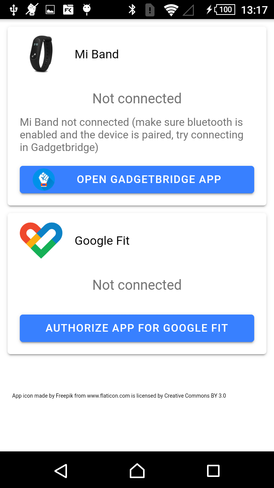

# Mi To Google Fit
This simple Android app is to connect to the Mi Band and send the step data to Google Fit.
It uses [GadgetBridge](https://gadgetbridge.org/), to connect en fetch the data from the watch. 
It is written in [ionic](https://ionicframework.com) using the [cordova-plugin-gadgetbridge](https://github.com/mmig/cordova-plugin-gadgetbridge) and [cordova-plugin-health](https://github.com/dariosalvi78/cordova-plugin-health).

Due to the issue that the Mi Fit app does not sync the step data reliably.

The app will display two cards, one for the Mi Band data and one for the Google Fit data. Both can display the todays current step count as read from Mi Band and Google Fit respectively. Tap on the step count values to re-sync the number. If Google Fit has a lower step count press "SYNC TO GOOGLE FIT" to send the missing step count data to Google Fit. At max, data for 2 days is send synced.

## First use

### Connect Mi Band
If the band is connected to the Mi Fit app, first disconnect it in this app. This will disconnect and remove the device from the bluetooth settings. Also it can be useful to "forget" Mi Band device in the bluetooth settings of your Android device.

In the MITOGO app click Open GadgetBridge. This will pop-up a Gadgetbrige window, press the + button. Now gadgetbridge will start scanning for a device. This can take a while. After a while the name of the device will show up, click on the the name. A settings page will pop-up, click "back" to continue. Now a connection will be set-up. The Band will vibrate, click the button on your Band.

### Authorize Google Fit
To send data to Google Fit the app should be linked to Google Fit. Press "AUTHORIZE APP FOR GOOGLE FIT" and follow the instructions allowing read/write access to activity data. This requires a active internet connection and that the Google Fit App is installed on the device.

## Build

The App is using 

### requirements
- Android Studio
- node.js npm
- [Ionic](https://ionicframework.com)
- [Cordova](https://cordova.apache.org/)

See [Ionic docs](https://ionicframework.com/docs) to setup your environment

run  
`> ionic cordova prepare android`  
`> npm install`  
`> ionic cordova build android --debug`  

### Setup Google Fit API premission
Allow the app to access the [Google Fitness API](https://developers.google.com/fit/android/). Goto [https://console.developers.google.com/apis](https://console.developers.google.com/apis), goto credentials, select create credentials, go to OAuth Client ID,Enable APIS and Services, enable Google Fitness.

To get SHA1 certificate fingerprints of your apk run:  
`keytool -list -printcert -jarfile yourapp.apk`

## Future work
- currently app only shows data for current day this can be extended to display other days
- display bar graph of last week 
